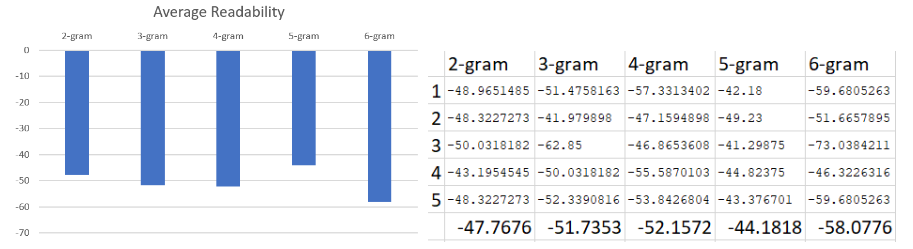

# mu-nlp-generate
Project for Natural Language Processing course @ Maastricht University, bachelor of Data Science and Knowledge Engineering.

Note that the data used is not directly available in this repository - but is assumed to exist in the LocalData folder. The dataset with its respective filename and source location can be found below.

**Dataset / FileName / Location**
  
Poem Dataset / "SongData.csv" / https://www.kaggle.com/mousehead/songlyrics

The above has a version that has been preprocessed for further purposes, called "ProcessedSongData.csv".

## Resources of interest
- https://www.kaggle.com/paultimothymooney/poetry-generator-rnn-markov
- http://groups.inf.ed.ac.uk/cup/ddd/
- https://crtranscript.tumblr.com/transcripts
- http://www.erinhengel.com/software/textatistic/?fbclid=IwAR2O5evMt-xbYwOuLgdhYFU9ItmhiQ3bQhrjSAOFOF8aY0p_Ytu1b4GjKqw

Data too big and cumbersome to be uploaded to GitHub can be found in this Google Drive folder:
https://drive.google.com/open?id=1W6bEjwbyoopn3NSndKyMtZoOt0b_zwlN

Two approaches:
N-gram model combined with bag of words.
LSTM

## Approach 1:
generates a dictionairy for combination of words and counts how often they occur for each n-gram up to the maximum inputted size.

example of the generated text using only the first 6 songs and n = 4:

'was please lucky wanna wanna she you'll lucky smile Who show a here time, tired kind your Andante something your slowly learn packing surrender be Well, Like do? walking found sweet thought Look dumb I Dum-be-dum-dum Touch Burning feels Well, Yes, I rotten question hours walkin' walkin' ma learn She's Holy Saying to think it's used sweet enough little time she ever play entitled things grow here You end you've be-dumb-be-dumb-dumb believe please - (You at means No fine face, sing, blue Andante Girl Once cutting Oh kind of out throwing together use Look away Being warm.'

### 2 experiments:
- how does the n-gram size inpact the results?
- does cleaning the text generate better texts?

these answers are based on a scoring metric provided by textatistic.

further explanation about the approaches and tests can be found in the report.

## Approach 2:
All the LSTM share some basic properties: They take as input word embeddings of size 100, trained on the full dataset, and as output return probabilities over 60'000 possible words.

- The first model has a single LSTM layer of 12 nodes (non-intentional, an 8 was unintentionally left out)
- The second model has a single LSTM layer of 256 nodes
- The third model has two consecutive LSTM layers of 256 nodes each.

### Generation

The example songs were generated with the third model.

When choosing the prediction with max score, all models made so far will usually just return "\\r\\n", the symbol for a new line - which makes sense, as this letter occurs for every line and in every song. However, the third model is usually able to predict a sequence like "I'm" or "you're" to a much better degree than the other two.

However, a small improvement - in terms of human readability appears to have been made by the following post-processing steps after receiving output, by:

1. penalizing the prediction for the '\\r\\n' word based on how long ago it last appeared in the input and,
2. Only selecting the top n classifications according to score, to select a word from.

This process was included to generate the below songs.

### Example songs

- seed: "she came to me one morning one lonely sunday morning"
- song: 'she came to me one morning one lonely sunday morning \\r\\n i m the night i m the i m \\r\\n i m a man \\r\\n i m the night \\r\\n i m a little \\r\\n and i m a little more \\r\\n you re me with the \\r\\n i m a little love \\r\\n i m the time \\r\\n i m the night \\r\\n i m not the way \\r\\n i m a way \\r\\n i m the love \\r\\n i m a in the love \\r\\n and i m the s the \\r\\n i m so the of the \\r\\n and i re the love of the night'

- seed: "welcome to the jungle where we got fun and games"
- song: 'welcome to the jungle where we got fun and games \\r\\n i m to let the night \\r\\n and i m the love \\r\\n i ve been a little one of the \\r\\n i know i m a love \\r\\n i ll be a little \\r\\n i m the world of the sun \\r\\n i m the night \\r\\n you know i m a little \\r\\n i m in the love \\r\\n i ll be the sky \\r\\n i m a little love \\r\\n i m you \\r\\n i m the night \\r\\n i m a is a time \\r\\n i m the love \\r\\n i m the in the'

- seed "he sleeps under black seas waiting lies dreaming in death"
- song: 'he sleeps under black seas waiting lies dreaming in death \\r\\n i can t i m the world \\r\\n i m a little little way \\r\\n and i m gonna be a be \\r\\n i ll be the sun \\r\\n i m a little little \\r\\n i m the night \\r\\n i m not the \\r\\n i m a little little \\r\\n i don t know you re the sun \\r\\n i m a little little \\r\\n i m a little man \\r\\n i m a little heart \\r\\n and i m to be a little \\r\\n i m a love of the way \\r\\n and i m a little'

It is mostly just capable of forming simple sentences of the "I'm x" variety, with some variety.
